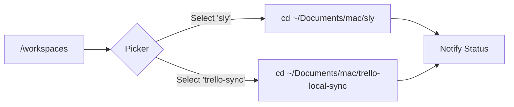

# Sly Telegram Workflows

You can control the Sly Supervisor remotely via your Telegram bot. Below are the active workflows and commands.

## 🕹️ Interactive Menu
Send `/start` or `/help` to bring up the interactive dashboard.

| Button | Command | Description |
| :--- | :--- | :--- |
| **🟢 Status** | `/status` | Check system health and safety status. |
| **📂 Workspace**| `/workspaces` | Switch between mounted repositories. |
| **🧪 Test** | `/test` | Run `cargo test` on the current workshop. |
| **📊 Report** | `/report` | Generate a proactive architectural insight. |
| **🚀 GitHub** | `/github` | Push current changes to remote. |
| **☁️ Cloudflare**| `/cloudflare` | Deploy modules to edge production. |
| **📜 Logs** | `/logs` | View the last 10 lines of system output. |

## 🚀 Advanced Workflows

### 📂 Multi-Repo Orchestration
Sly can transition between different codebases without restarting the supervisor.

### 🛠️ The Safety-to-Production Cycle
The recommended workflow for remote development:
1.  **Initiate**: Send task or `/run <task>`.
2.  **Monitor**: Receive progressive OODA traces in chat.
3.  **Verify**: Click **🧪 Test** once task is complete.
4.  **Promote**: Click **🚀 GitHub** to ship verified code.

## 🤖 Autonomous Lifecycle Notifications
Sly will now proactively ping you when a session reaches a significant state:

| Event | Interactive Actions |
| :--- | :--- |
| **Task Completed** | `⏪ Undo`, `📜 Logs`, `🧪 Test` |
| **Limit Reached** | `⏭️ Proceed`, `🛑 Stop` |
| **Error Occurred** | `⏪ Undo`, `📜 Logs` |
| **Commit Required** | `Confirm ✅`, `Abort ❌` |

> [!TIP]
> All actions in the table above appear as **Interactive Buttons** at the bottom of the notification message for one-click response.
